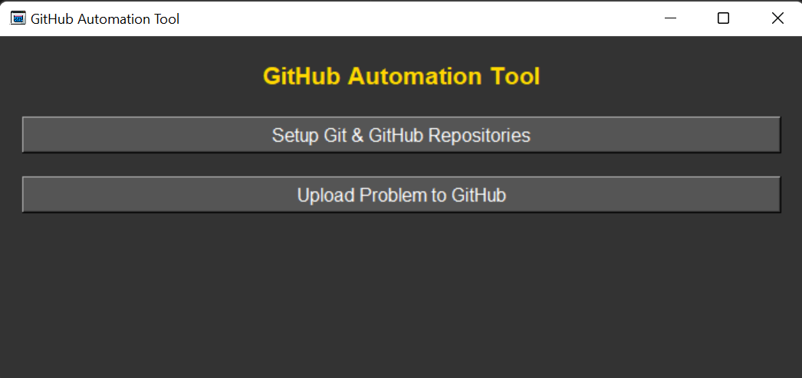
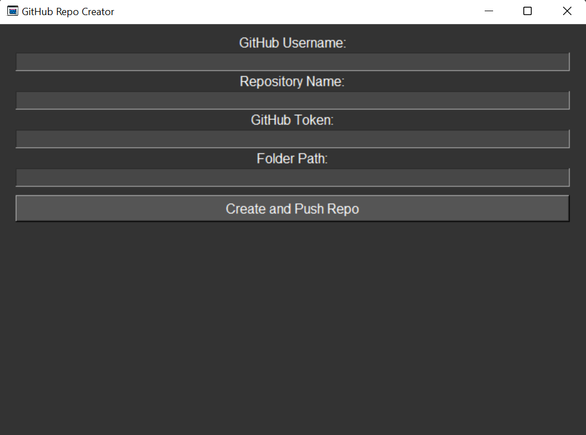
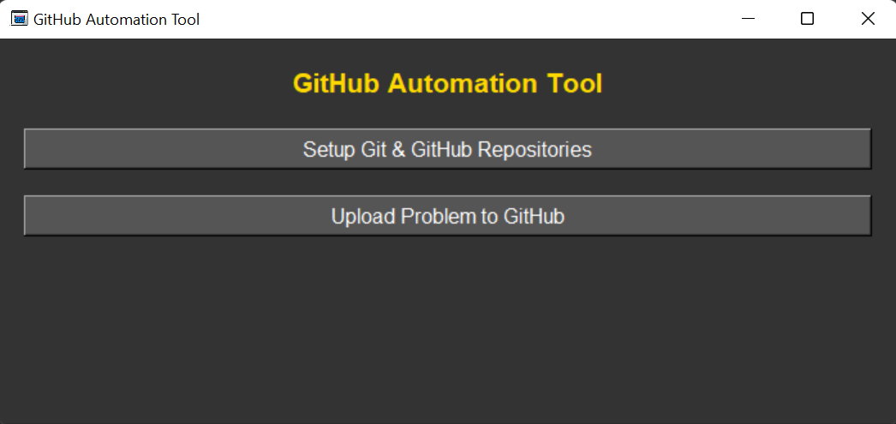
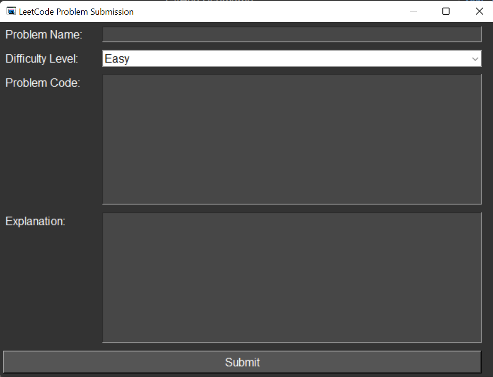

# Upload Leetcode Problems and your Solutions to Your Github Repository And Also Update Them Simultaneously to Excel Sheet With The Github File Link Automatically

## How To Download:

## Method 1

### 1. Download it's zip file by clicking on `code` and then `Download Zip`

### 2. Extract the zip file and open the folder

## How To Use This Application:

> Click on `Setup Git and Github Repositories`. Then

- Enter your `github username` (can be found on the github page, eg: `ahsanashraf148`)
- Enter the repository name by which you wish to create the repository
- Enter `Github Token` (can be retrieved by following the instructions at the bottom)
- Create a new folder where you wish to put code files and maintain as a git repo and
  - Enter the path of the folder
- Click on `Create and Push Repo`

### Go to main window again

> Click on Upload Problem To Github
> 

- Enter `Problem name`
- Select `Difficulty Level`
- Enter the `problem code` and it's `explanation`
- Click `Submit`

### Congrats, the problem file has been created on the given folder under the set diffcilty level folder, and has been uploaded to Github as well. Moreover it's name, difficulty level, github file link and explanation has been apppended on `problems.xlsx` excel file

## Prerequisites

### Should have Python installed

### To get a `GitHub token`, follow these steps:

`Log in to GitHub:` Open your web browser and log in to your GitHub account.
`Access Settings:` Click on your profile picture in the top right corner, then select `Settings` from the dropdown menu.
`Developer Settings:` Scroll down to the bottom of the sidebar and click on "Developer settings".
`Personal Access Tokens:` In the left sidebar, click on "Personal access tokens".
`Generate New Token:` Click on the "Generate new token" button.
`Token Description:` Enter a note or description for your token to remember its purpose like "using the token for leetcode problem automation for creating github repositories automatically. Expiry of this token is on `some date`"
`Select Scopes:` Choose the scopes or permissions you want to grant this token. For repository operations, make sure to select the appropriate scopes under the "repo" category.
`Generate Token:` Click the "Generate token" button at the bottom of the page.
Copy Your New Token: Make sure to copy your new personal access token now. You won’t be able to see it again!
`This token acts as a password, so keep it secure and do not share it.`
