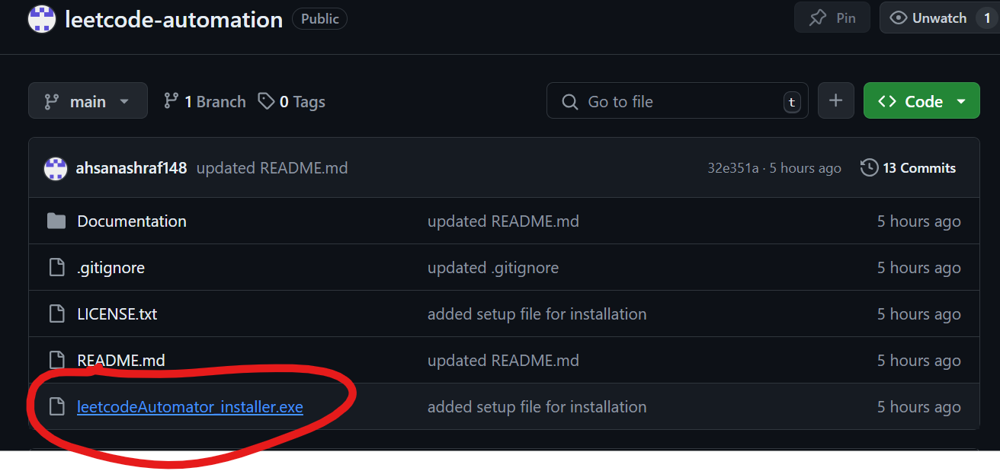
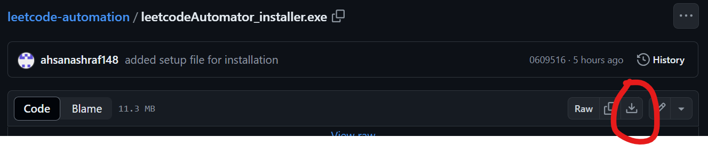
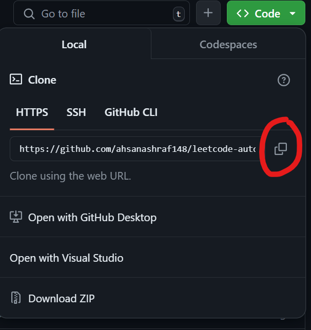
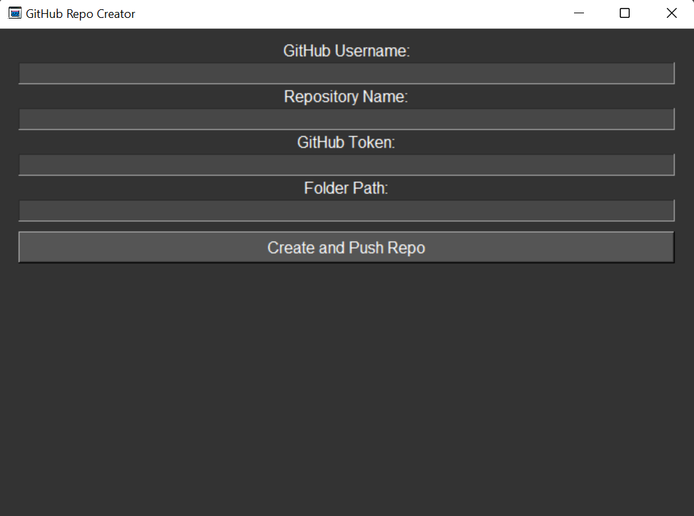
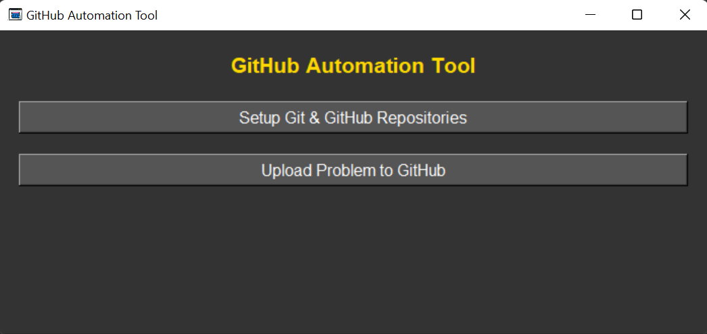
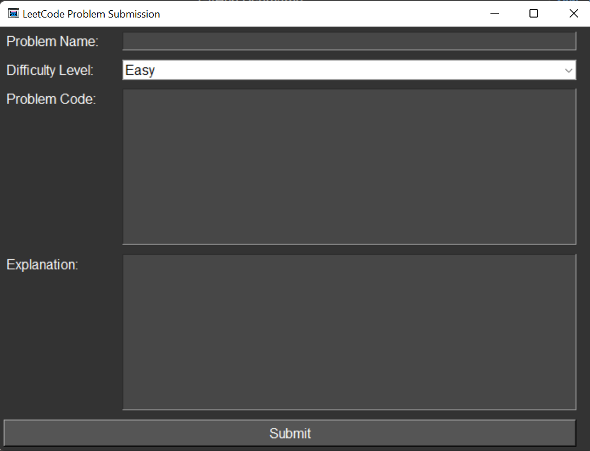

# Upload Leetcode Problems and Solutions to GitHub and Excel

Automatically upload Leetcode problems and your solutions to your GitHub repository and update an Excel sheet with the GitHub file link.

## How to Download

### Method 1: Download `LeetcodeAutomator_installer.exe`




1. Click on `LeetcodeAutomator_installer.exe`.
2. Click on `Download icon` and download it.

### Method 2: Clone The Repository



1. Click on `code`
2. Copy the web URL
3. Open Gitbash on any folder you want to clone the repository in and paste

```shell
    git clone {url you copied} .
```

## Click on `LeetcodeAutomator_installer` to install the app

### Do quick steps, give github repo folder location to download the app and `Leetcode Automator` will be installed.

## How to Use

### Setup Git and GitHub Repositories

1. Click on `Setup Git and Github Repositories`. Then wait for a few seconds (some dependencies need to be installed)
2. Enter your `github username`.
3. Enter the desired repository name.
4. Enter your `GitHub Token`.
5. Create a new folder for your code files and enter its path.
6. Click on `Create and Push Repo`.




### Upload Problem to GitHub

1. Go back to the main window.
2. Click on `Upload Problem To Github`.
3. Enter the `Problem name`.
4. Select `Difficulty Level`.
5. Enter the `problem code` and its `explanation`.
6. Click `Submit`.




**Congratulations!** The problem file has been created in the specified folder, uploaded to GitHub, and its details appended to `problems.xlsx`.

## Prerequisites

- Python must be installed.

## Getting a GitHub Token

1. **Log in to GitHub:** Open your web browser and log in to your GitHub account.
2. **Access Settings:** Click on your profile picture, then select `Settings`.
3. **Developer Settings:** Scroll down and click on "Developer settings".
4. **Personal Access Tokens:** Click on "Personal access tokens".
5. **Generate New Token:** Click on "Generate new token".
6. **Token Description:** Enter a description for your token.
7. **Select Scopes:** Choose the necessary scopes under the "repo" category.
8. **Generate Token:** Click "Generate token" at the bottom.
9. **Copy Your New Token:** Copy your new token immediately. You won’t be able to see it again!

**Important:** Treat your token as a password. Keep it secure and do not share it.

## Example Repository Created Through This Application

[Example Repository](https://github.com/ahsanashraf148/leetcodeSampleRepo.git)

### You can suggest changes by adding an issue
